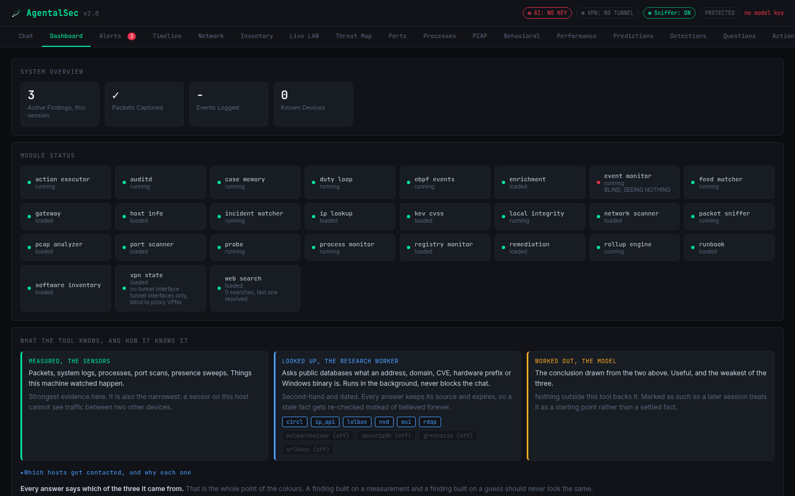
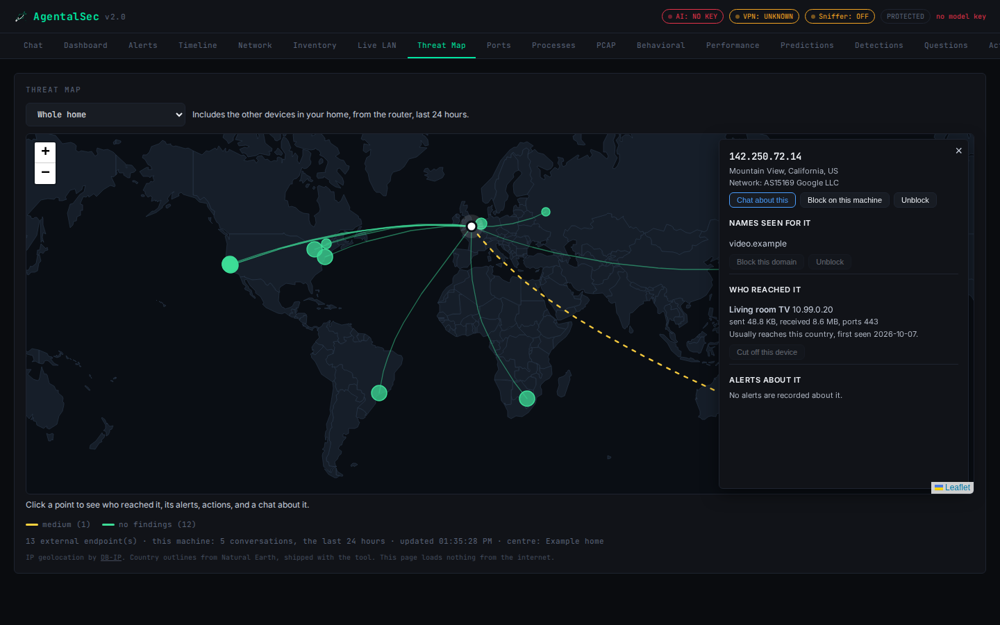
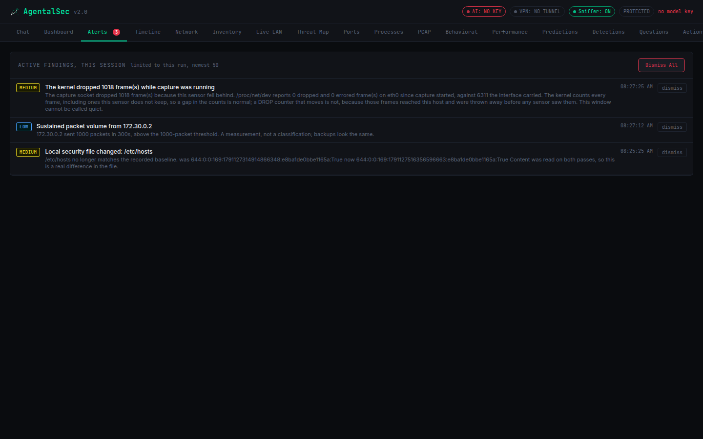
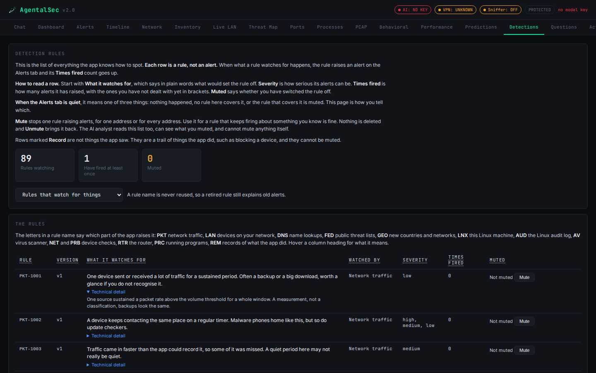

<p align="center">
  <picture>
    <source media="(prefers-color-scheme: dark)" srcset="assets/logo/orca_hero_dark.svg">
    
  </picture>
</p>

# AgentalSec Linux

Network and host security monitoring for Linux, with an AI analyst that
investigates but never acts without your approval.

AgentalSec watches your network and the machine it runs on, keeps what it sees
in a local database, and lets you ask a language model about it in plain
language. It runs entirely on your own machine. It is built around one rule:
a sensor that cannot see must say so, because a quiet dashboard and a blind
one should never look the same.

<p align="center">
  
</p>

## Best setup

AgentalSec works on its own on any Linux computer. It sees everything that
computer does. It sees your **whole network** when it is paired with a router
it can talk to:

1. **AgentalSec on a Linux computer** that stays on: a desktop, a laptop, a
   mini PC or a Raspberry Pi.
2. **A router that allows SSH access**, with the small AgentalSec agent
   installed on it. That includes:
   - routers running **OpenWrt**, and similar open firmware;
   - a **Raspberry Pi or any Linux box** set up as your router;
   - **pf based firewalls**;
   - any router with an SSH server, a root shell and a standard `sh`.

With the agent on the router, AgentalSec sees every device on your network,
its live traffic and where it connects, including phones, TVs and other
devices that never talk to the AgentalSec computer. It can also block a
device, an app or a domain on the router itself, with your approval.

**Modem or router?** The box from your internet provider is usually a modem
and router in one, and most of those do not allow SSH. The usual setup is to
put your own router behind it: connect an OpenWrt router (or a Linux box
acting as one) to the provider's box, and connect your devices to that
router. The provider's box then only brings the internet in, and your router,
which AgentalSec can talk to, runs your network.

How to enrol a router: [docs/ROUTER.md](docs/ROUTER.md).

## Documentation

- [docs/TOUR.md](docs/TOUR.md), every dashboard tab, with screenshots
- [docs/SENSORS.md](docs/SENSORS.md), every sensor: what it watches, what it
  needs, how it fails, how to configure it
- [docs/ANALYST.md](docs/ANALYST.md), connecting a model, what the analyst
  can do, approval, the duty loop
- [docs/ROUTER.md](docs/ROUTER.md), the router agent, Pi-hole and AdGuard
  Home, other Linux machines over SSH
- [SETUP.md](SETUP.md), installation step by step

## How it works

1. **Sensors.** About thirty modules, each watching one thing: packets,
   processes, logs, ports, devices, files. Every observation goes into a local
   SQLite database together with the name of the sensor that made it.
2. **Memory.** Packets, events, devices, findings, incidents, and a slowly
   built picture of what normal looks like on your network. Old data is
   rolled up into hourly summaries and pruned on a schedule.
3. **Analyst.** A language model with about a hundred tools for reading that
   memory. It can read almost anything. Every action that changes your system
   waits for your approval.

Every answer comes from one of three places, and the dashboard colours them
differently: **measured** by a sensor here, **looked up** in a public source,
or **worked out** by the model. When a sensor cannot see, for lack of
privilege, a missing tool or a service that is off, it says so on the
dashboard and to the analyst.

## What it watches

**On the network.** Every packet on this machine's link, with the process
behind each connection. Beacons, the timing signature of malware checking in.
Attack signatures in plaintext traffic. Server names and JA3 fingerprints of
encrypted connections, QUIC included. DNS lookups, checked for machine
generated domains and DNS beaconing. ARP spoofing, rogue DHCP servers and name
poisoning on the LAN. The devices on your network and how each was
identified. TCP and UDP port scans.

**On this machine.** Every process, checked against the digest its package
recorded at install. Every listening socket and its owner. The journal, auth
log and audit log. An optional eBPF camera that records every process start
and outbound connection as it happens. File integrity for system files and
SSH keys, and an hourly sweep for setuid programs. Startup entries, installed
software, background apps you can switch off, VPN state.

**Beyond this machine.** Your router, through a small agent over SSH, on
OpenWrt, a Raspberry Pi or Linux box acting as a router, or any router with
SSH access: every device's live traffic, its destinations, and blocks on the
router (see [Best setup](#best-setup)). Pi-hole or
AdGuard Home query logs. Other Linux machines over SSH. See
[docs/ROUTER.md](docs/ROUTER.md).

**Threat intelligence.** ThreatFox, URLhaus, Feodo Tracker, AlienVault OTX and
the CIRCL MISP feed, matched against what your network talks to. The CISA
catalogue of known exploited vulnerabilities, with severities. Lookups of
addresses, domains, CVEs and file hashes in public sources.

**What normal looks like.** Every address, process, port and user is watched
across sessions, and behaviour far outside its own normal becomes a
deviation. Each program and each device also learns the countries and
networks it normally reaches, and after a three day learning period a first
contact with a new one becomes an alert.

Every sensor, in detail: [docs/SENSORS.md](docs/SENSORS.md).

<p align="center">
  
</p>

## The AI analyst

<p align="center">
  
</p>

Ask in plain language: "check my connections", "any intrusions?", "what is
this process?". The analyst answers from the database through about a
hundred narrow tools, and can read the app's own source code to explain how a
finding was produced. It has no shell.

- **Any model.** OpenAI-style and Anthropic-style APIs, hosted or local
  (Ollama, LM Studio, vLLM, SGLang).
- **It says what it could not see**, and tells "nothing happened" apart from
  "nothing was looking".
- **It asks you** when it needs something only you know, makes predictions
  that are graded afterwards, and remembers past cases.
- **It works while you are away.** An incident watcher groups findings as
  they arrive, and a duty loop wakes four times a day, or at once in an
  emergency, to investigate and write a report.

**Nothing changes without your approval.** Ending a process, a firewall
block, quarantining a file, disabling a service, a block on the router: each
is proposed as a card and waits for you. An approved action is carried out
once, by a separate worker, and recorded.

Connecting a model, the full list of gated actions and the duty loop:
[docs/ANALYST.md](docs/ANALYST.md).

## How it helps stop an attack

AgentalSec finds the problem, works out what is happening, proposes the
response and carries it out the moment you approve. It never acts on its own.
A typical case, from start to finish:

1. **A sensor sees it.** A program on this machine starts calling the same
   unknown server every minute, or a device on your network looks up a domain
   that a threat feed lists.
2. **The incident watcher groups it.** Related findings become one incident,
   so ten alerts about one cause are one case. A high severity incident sends
   a desktop notice, and a burst inside ten minutes arrives as one notice.
3. **The analyst investigates.** For a high severity incident the duty loop
   wakes at once. It reads the evidence through its tools: the program and its
   file, where it connects, the threat feeds, what that device normally does.
   Then it writes a report with its verdict on the Agents tab.
4. **It proposes the response.** The request appears on the Actions tab,
   saying what it would do and why. Nothing has run yet.
5. **You decide.** Approve, and a separate worker carries it out once and
   records it, even if the dashboard is closed. Deny, and nothing happens.

The responses it can propose, from the narrowest to the widest:

- **On this machine:** end a process, stop a service, quarantine a file
  (moved to a vault, and restorable), switch off a background app.
- **At this machine's firewall:** block a port, or a device's traffic to and
  from this computer.
- **On the router,** with the router agent: cut a device off the whole
  network, or sinkhole a domain so that no device can reach it. From the LAN
  tab you can also block a single app, such as TikTok or Fortnite, for one
  device.

A block on this computer's firewall protects this computer only. A block on
the router protects every device on your network, which is why a router with
the agent is the recommended setup ([Best setup](#best-setup)). Blocks,
quarantines and background app changes can be undone from the Actions tab.

Alerts that turn out to be harmless can be silenced for one rule on one
device or file, without hiding anything else about it, so the next real
alert stands out.

## How well it detects malware

Because of my own limits, I could not test AgentalSec against its full
detection capabilities. I built and tested it in a home lab: one home
network, a handful of computers, phones and consoles, and no real malware.
That is enough to show that each detection works as designed. It is not
enough to say how much real malware it would catch.

Measuring that takes a malware lab: a large collection of real, current
samples, run one after another on isolated machines that can be wiped, with
a record of which ones were caught. Running real malware on my home network
would put every device on it at risk, so I never did.

What the tests here do cover:

- **Each detection fires.** Harmless stand-ins play the part of an attack: a
  program started from a temporary folder, a fake program wearing a system
  name, a regular check-in to a test server, a domain from a threat feed.
- **Each detection stays quiet on normal use.** The same rules run against
  everyday activity on a real home network, and the noisy ones were tuned
  until they stopped raising alarms about ordinary devices and services.
- **File scanning, when ClamAV is installed.** Running programs and new
  files in temporary and download folders are scanned against ClamAV's
  signatures, tested with the standard EICAR test file. This finds known
  malware families only; how much it catches depends on ClamAV's database.

What they cannot tell you:

- **How often it catches malware nobody has seen before.** That depends on
  how the malware behaves, and only a large, varied set of real samples can
  answer it. ClamAV covers known malware; new malware is left to the
  behaviour-based detections.
- **A detection rate.** No percentage is claimed, because no honest one could
  be measured in a home lab.

With ClamAV installed, AgentalSec also scans files, but it is not a full
antivirus: it scans on a schedule rather than at the moment a file is opened,
and it does not scan memory. So treat it as a second pair of eyes, and its
findings as leads to follow up. If you can test it in a proper malware lab,
your results would be very welcome.

## Keeping itself honest

- Important writes go into a **hash-chained tamper journal**, so a later edit
  to the database shows up.
- The analyst may **silence** at most 10 things a day, and the Review tab
  shows everything silenced and who did it.
- The Settings tab lists **every collector** and why it is on, off or broken.

<p align="center">
  
</p>

The dashboard has 21 tabs, from live LAN traffic to the analyst's prediction
record. A tour of each: [docs/TOUR.md](docs/TOUR.md).

## Requirements

- Linux. Tested on Ubuntu 24.04 and Linux Mint; Debian works the same way.
- Any CPU that runs Python, including x86-64 and ARM64.
- Python 3.11 or newer.
- Root or `CAP_NET_RAW` for packet capture, given by the privileged launcher.
- For the analyst: an account with a model provider, or a local
  OpenAI-compatible server. Everything else runs without one.
- Python packages from `requirements.txt` (maxminddb reads the map data).
- Free data files, fetched once by the scripts below: DB-IP IP to City Lite
  for the threat map, DB-IP IP to ASN Lite for network owner names and
  network baselines (both CC BY 4.0, attribution shown on the map), and the
  IEEE registry for hardware vendor names.

## Quick start

The full steps, with every optional part, are in [SETUP.md](SETUP.md).

```bash
sudo apt install -y git python3 python3-pip libpcap0.8 iproute2 net-tools \
    nftables iptables iputils-ping openssh-client pkexec libnotify-bin auditd
git clone <repository-url> agental_sec_linux
cd agental_sec_linux
pip install --user --break-system-packages -r requirements.txt
cp config.linux.example.json config.json
cp .env.example .env
chmod 600 config.json .env
```

Put a dashboard key in `.env` as `AGENTAL_APP_API_KEY`:

```bash
python3 -c "import secrets; print(secrets.token_hex(32))"
```

Then fetch the map and vendor data, and check the install:

```bash
python3 scripts/fetch_geoip.py
python3 scripts/fetch_geoip.py --asn
python3 scripts/update_oui.py
python3 main.py --check
```

**Last step, and the one not to skip: install the launchers.** The app does
not create them by itself. Run this once, from the project folder, as your
own user (not with sudo):

```bash
./scripts/install_launchers.sh
```

It adds two launchers, **AgentalSec** and **AgentalSec (privileged)**, in
three places: your app menu, your desktop and the project folder. From now on,
start AgentalSec by clicking one of them. If a desktop icon says
"untrusted", right-click it and choose "Allow launching". If you move the
project folder, run the script again.

Until the launchers are installed, every start of the app and every
`main.py --check` prints a reminder with the exact command.

The dashboard opens at http://127.0.0.1:5000. Set the model provider on its
Settings tab.

## Normal and privileged

`install_launchers.sh` adds two launchers:

- **AgentalSec** runs as you. Packet capture and firewall changes are off, and
  some host details are hidden, such as other users' process command lines.
  Each sensor reports what it is missing.
- **AgentalSec (privileged)** asks for your password and runs as root, with
  every sensor working.

To keep the app unprivileged and still carry out approved actions, install
the root action helper described in [SETUP.md](SETUP.md).

## Privacy

- Your data stays in the project folder: the database, `config.json` and
  `.env`. Stored secrets are encrypted with a key derived from this machine.
- The dashboard listens on 127.0.0.1 only and needs its API key. Requests that
  name any other host are refused. To use it from another machine, use an SSH
  tunnel (see [SETUP.md](SETUP.md)).
- Outbound traffic goes to the model provider you configure, the threat feeds
  and lookup services, and a public address lookup that places the threat
  map's home pin. Turn the lookup off with `geoip.locate_online` in
  `config.json`.
- Whatever you ask is sent to the model you configure, together with the data
  its tools read. With a local model server, nothing the analyst reads leaves
  your network.

## What it sees, and how to see more

Every security tool has edges. AgentalSec names its own, so you always know
what a quiet dashboard means, and for each one there is something that
extends its view.

- **It sees this computer, and your whole network with a router.** On its
  own, AgentalSec sees the traffic of the computer it runs on. Add the router
  agent ([Best setup](#best-setup)) and every device's internet traffic comes
  into view. Traffic between two devices inside your network stays private to
  them.
- **It reads what encryption leaves visible.** Most traffic today is
  encrypted, and AgentalSec does not pretend to read it. It reads what can be
  read: the server name and fingerprint of every encrypted connection, and
  full signatures on plaintext traffic.
- **It watches connections as well as open ports.** A port scan shows what
  is listening; outbound connections, such as a program calling home, are
  covered by packet capture, beacon detection and the eBPF camera.
- **Its beacon detector is tuned to avoid false alarms.** Very slow or
  deliberately irregular callbacks can fall outside it, so every repeated
  contact is also listed with its timing for you to judge.
- **It points you to a network, not a street.** The map places an address
  where its network is registered, which is good for "this left the
  country", not for finding a person.
- **It works alongside an antivirus, not instead of one.** With ClamAV
  installed it scans running programs and new files in /tmp, /dev/shm and
  Downloads against ClamAV's signatures, and checks each hit with
  MalwareBazaar. It does not scan memory, and it finds only what those
  signatures know. Without ClamAV, a suspicious program's hash is looked up
  in MalwareBazaar alone, which matches only files already uploaded there.
- **It is a watchman, not a vault.** It runs on the computer it protects, so
  anyone with full control of that computer could stop it. Its hash-chained
  journal makes later edits to its records visible, and its findings are
  strong leads for you to follow up.
- **It uses ordinary kernel interfaces,** the eBPF camera included. A rootkit
  built to hide below those can stay out of view, which is why the app shows
  exactly which sensors were watching at any moment.
- **It answers best to neutral questions.** Like any analyst it can be led by
  a confident claim. Ask neutrally, or name your devices on the Inventory
  tab, and it works from facts.

## Tests

```bash
python3 scripts/run_tests.py
```

Each file in `tests/` also runs on its own with `python3 tests/<name>.py`.

## License

MIT, see [LICENSE](LICENSE).
